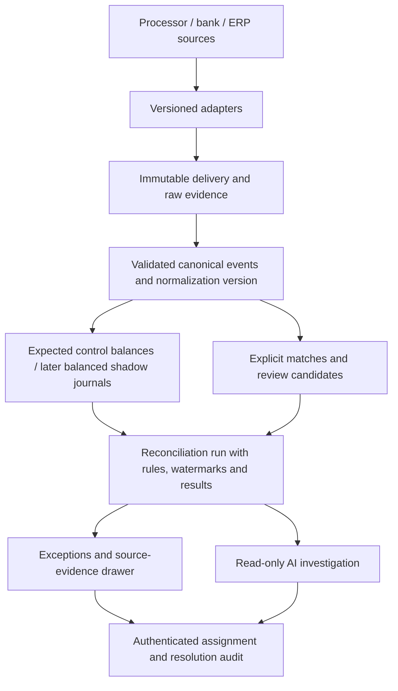

# Repository audit and target product

Audit baseline: `122699d`, 2026-09-06. Baseline verification: 30 Django tests passed on locally installed Django 5.1.15 (requirements specify 5.2). This audit precedes implementation. Findings below describe the baseline, not completion claims.

## Why deploy this?

A finance controller would deploy LedgerLens to independently compare contracted deductions and settlement obligations with processor reports, bank receipts, and ERP records. It earns its place if it catches underpayments or missing postings that an individual system cannot see, produces a reproducible evidence package, and reduces time spent assembling that package. It is a financial evidence, reconciliation, and ledger control layer; the processor and ERP remain authoritative.

| Workflow / user | Sources / concrete failure | Detection and evidence | Operator action / removed manual work | Risk reduced / success measure |
|---|---|---|---|---|
| Contract fee review / FinOps | Contract + captures + charged fees; outdated provider pricing overcharges a merchant | Effective-dated fee rule versus individual charged fees; cited calculations | Raise a provider recovery claim; replaces fee spreadsheet recalculation | Margin leakage; recovered value and false-positive rate |
| Settlement completeness / settlement operations | Captures + refunds + settlement report; a refund is deducted twice | Sum explicit settlement constituents under a versioned refund policy | Request corrected settlement file; replaces manual batch reconstruction | Underpayment; unexplained settlement value and resolution time |
| Bank receipt verification / treasury | Settlement report + bank statement; reported transfer differs by INR 3.40 | Reported obligation versus bank credit with exact reference evidence | Obtain bank/provider transfer evidence; replaces UTR lookups | Cash shortfall; confirmed differences and time to evidence |
| ERP posting control / controller | Bank + ERP export; bank receipt never posted or wrong amount posted | Bank-to-GL check cites both records or identifies missing evidence | Ask accounting to correct the authoritative ERP; replaces bank-book comparison | Misstated cash/close delays; missing postings and close time |
| Refund lifecycle / merchant operations | Capture + multiple processed refunds + settlement deductions | Bound refunds by original capture and reconcile their explicit relationships | Escalate duplicate/refund deduction issue; replaces refund history assembly | Double refunds; incorrectly deducted value |
| Delivery integrity / engineering | Repeated webhook/API events; same ID carries different money | Immutable identity/hash comparison with retained delivery outcome | Replay failed import or quarantine provider conflict; replaces log archaeology | Double counting; duplicate suppression/conflict detection rate |
| Settlement timing / treasury | Processor dates + expected receipt SLA + bank feed; credit not due yet | As-of reconciliation separates waiting from overdue; snapshots timestamps | Wait, request bank evidence, or escalate overdue receipt | False alarms/liquidity surprises; overdue value and alert precision |
| Incident/audit reconstruction / internal audit and SRE | Prior runs + rules + inputs + operator actions; evidence changes after investigation | Immutable run snapshots reproduce what was known at a stated time | Export incident evidence; replaces reconstructing old database state | Unauditable decisions; reproducibility rate and incident preparation time |

## Current architecture and flow

Django/DRF modular monolith, SQLite, React/Vite. JSON ingestion or a narrow CSV parser creates FinancialRecord and IngestionBatch rows. Engine groups by a caller-supplied entity, calculates fixed fee/tax expectations, updates one case and its checks; matcher deletes/rebuilds edges; optional Anthropic loop reads records/checks. React fetches case/metrics/graph data and raw evidence. Synthesized audit derives timestamps from mutable projections. CI runs backend tests and frontend checks/build.

Useful foundations: integer money, protected source FKs, batch replay checks, explicit evidence edges, first-break amounts, API-backed case screens, bounded AI loop, citation validation and no-key fallback. FinancialRecord is evidence, not an accounting ledger: no accounts, balanced journals, periods, reversals or posting balances.

## Findings

| Severity | Files | Failure example / why it matters | Recommended change |
|---|---|---|---|
| P0 | api_views.py, settings.py | Anonymous caller chooses another organization's slug, reads financial data or assigns cases; AllowAny is the default | Authenticate; verify membership on every endpoint; roles on writes; demo opt-in only |
| P0 | models.py, ingestion.py | ORM update bypasses save; amount/source/reference can change even through save, invalidating past conclusions | Protect all evidence fields and supported ORM mutation paths; retain normalized hash/version; DB controls before pilot |
| P0 | engine.py | Uses first settlement/credit and ignores remaining transfers; balanced aggregate may hide component errors | Explicit bounded reconciliation scopes; compare all supported receipts, reject unsupported allocations |
| P0 | engine.py | Missing fee/order can still produce MATCHED; ERP posting is never checked | Classify from mandatory checks; distinguish unknown from actual zero; add GL check |
| P0 | engine.py | 120/1800 bps imposed on every company and every date | Source/currency/effective-date rule versions; no rule means block |
| P0 | matcher.py | Nearest of two equal candidates becomes a link; external IDs collide across sources; explicit edges bypass type checks | Persist all candidates, no automatic inference approval, validate type/org/currency; reject ambiguous identities |
| P0 | engine.py, matcher.py | Rerun overwrites checks and deletes edges; 15:42 finding cannot be reconstructed | Append immutable input/rule/match/check/result snapshots; case remains latest projection |
| P1 | bank_statement_adapter.py | Parser rewrites raw fields and drops unknown columns; one nonnumeric row aborts the whole file | Preserve original rows and row failures; version adapter; distinguish canonical template from bank-specific format |
| P1 | ingestion.py | Batch replay leaves no delivery record; uniqueness race can abort a batch; rejection lacks original payload | Record immutable delivery envelope and outcome; serialize source imports; retain rejected evidence |
| P1 | engine.py | Missing bank immediately treated as failure without due date; adjustment note mistaken for explanatory proof | Version timing rules and store as-of time; prose is never monetary evidence |
| P1 | agent.py | Broad silent fallback; any org record can be retrieved; two-decimal assumption; citation checks do not prove prose | Restrict to run evidence, track fallback reason; currency exponents; state semantic evaluation limitation |
| P1 | api_views.py, models.py | Mutable owner string and no transition log | User FK, role-controlled assignment/workflow with persisted audit events |
| P1 | api_views.py, src/App.tsx | Cross-currency totals displayed as INR; source health hardcoded 4/4; first case called highest-risk | Currency-specific aggregates and real source freshness; honest labels |
| P2 | matcher.py, api_views.py | Repeated full scans, unbounded list/detail/audit results, synchronous ingestion | Bounded limits now; measure before indexing/worker/bulk optimization; PostgreSQL CI |
| P2 | README.md, plan.md, status.md | Header scoping called tenant safety, single table called equally immutable, batched support overstated | Replace completion claims with executed capability/limitations matrix |

## Smallest credible release and priorities

P0: membership auth, immutable normalized evidence, immutable effective-dated rules, reproducible run snapshots, mandatory fee/tax/settlement/bank/GL checks, conservative matching, explicit unsupported-flow rejection. Preserve current visual structure.

P1: retained delivery failures, real CSV ingestion, source freshness, audited assignment/workflow, read-only run/rule APIs, realistic regression scenarios. P2: durable background jobs, provider adapters, shadow journals, benchmark-led optimization and cross-case AI.

Scope: one currency per explicit settlement scope with captured payments and processed refunds. Do not infer that every record for a merchant belongs in one settlement. Aggregate checks alone do not prove constituent allocation, chargeback correctness, or balanced accounting. Unknown lifecycle states must block rather than disappear.

## Target architecture (target, not all implemented)

A shadow ledger is appropriate when we introduce clearing/payable/reserve accounts and need to prove balanced expected postings. For this stage, versioned expected-versus-actual control calculations solve a narrower real problem without falsely labeling evidence rows journal postings. Do not add an ERP or manufacture postings for unsupported event types.

## Arithmetic correction to the requested acceptance example

12.31 crore minus 12.309 crore = INR 10,000. 12.309 crore minus 12.3087 crore = INR 3,000. Total expected-to-bank difference = INR 13,000, not INR 30,000. ERP equals bank. Tests must preserve these exact stage differences instead of repeating the requested incorrect total.

## Reference decisions

DRF authentication and permission checks are separate: https://www.django-rest-framework.org/api-guide/authentication/
Django QuerySet.update bypasses model save: https://docs.djangoproject.com/en/5.2/ref/models/querysets/#update
Deployment settings: https://docs.djangoproject.com/en/5.2/howto/deployment/checklist/
